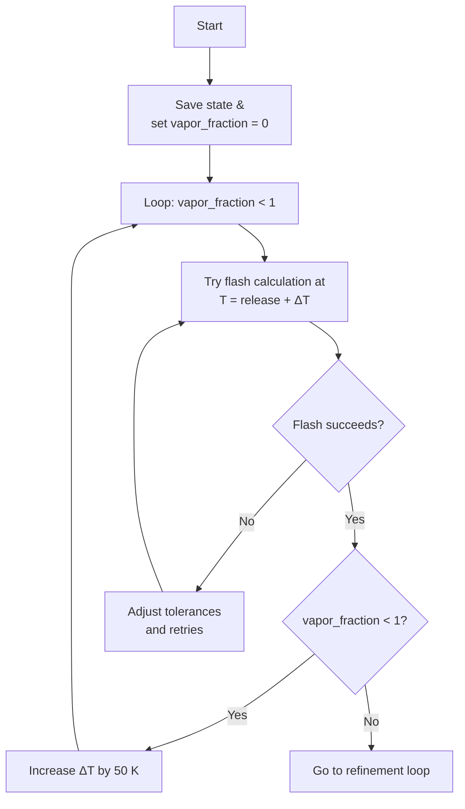
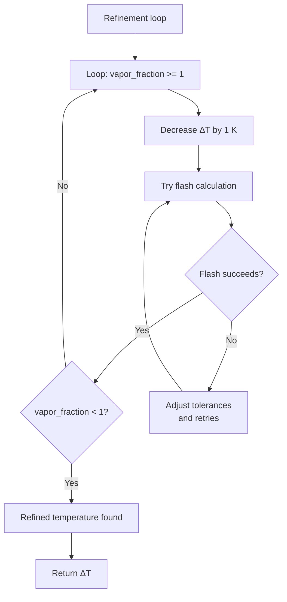

# Flash Operations

$$
\text{Burn Rate} \left(\frac {kg} {m²s}\right) = 1.27 \cdot 10^{\text{-6}} \rho_f  
\left[ 
  \frac{\Delta H_{\text{c}}}
       {\Delta H_{\text{v}} + c_p (T_{\text{b}} - T_{\text{f}})}
\right]
$$

Where:

- \( \rho_f \) = **Density** of the fuel \((\text{kg/m}^3)\)
- \( \Delta H_{\text{c}} \) = **Heat of combustion** \((\text{kJ/kg})\)
- \( \Delta H_{\text{v}} \) = **Heat of vaporization** \((\text{kJ/kg})\)
- \( c_p \) = **Specific heat** \((\text{kJ/kg·K})\)
- \( T_{\text{b}} \) = **Boiling point temperature** of the fuel \((\text{K})\)
- \( T_{\text{f}} \) = **Actual fuel temperature** \((\text{K})\)

$$
\text{Evaporation Rate} \left(\frac {kg} {m²s}\right) = k \cdot \left( \frac{T_{\text{b}} - T_{\text{f}}}{\Delta H_{\text{v}}} \right)
$$

Where:

- \( k \) = **Constant** (for average soil and concrete; k = 10.5)
- \( T_{\text{b}} \) = **Boiling point temperature** of the fuel \((\text{K})\)
- \( T_{\text{f}} \) = **Actual fuel temperature** \((\text{K})\)
- \( \Delta H_{\text{v}} \) = **Heat of vaporization** \((\text{kJ/kg})\)

*Representative fluxogram of the buble temperature*

*Representative fluxogram of the buble temperature*
