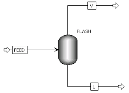
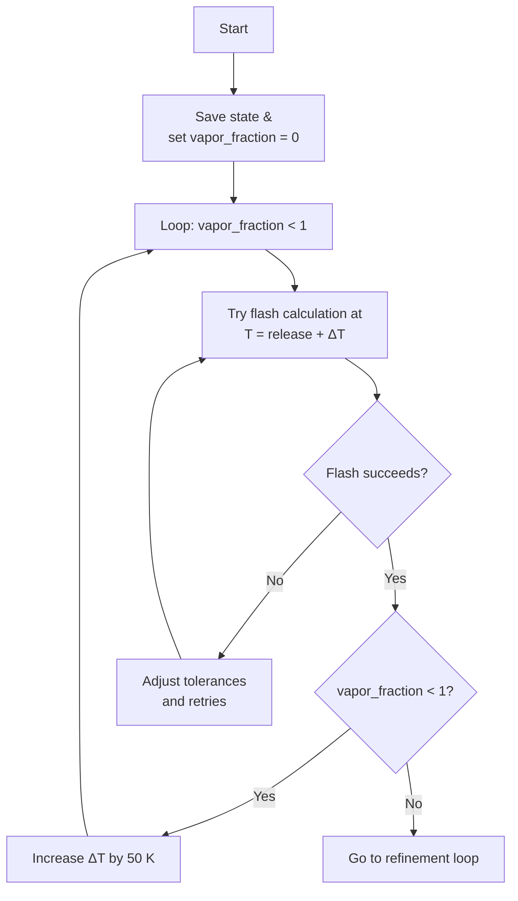
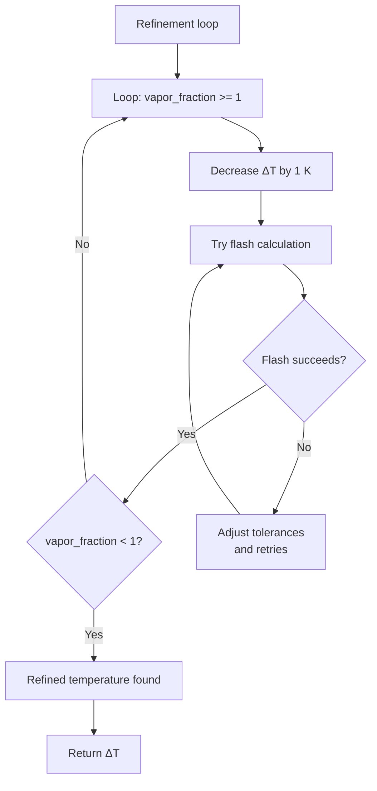

# Flash Operations

## Overview

A **flash operation** is a rapid phase separation process in which a liquid mixture is introduced into a flash drum, resulting in the formation of two distinct phases: a vapor phase and a liquid phase. This operation occurs rapidly and is based on the principle of phase equilibrium, where the vapor and liquid phases reach thermodynamic balance at a given temperature and pressure.

{ style="display: block; margin: 0 auto;" }

Simple flash drum example.

---

## Flash Operation Logic

In the code, two sequential flash operations are performed:

### 1. First Flash Operation

The first flash is executed using the **temperature** and **pressure** specified by the user.

### 2. Second Flash Operation

After the first separation, a second flash operation is performed.
In this step, the system conditions are changed to **ambient temperature** and **ambient pressure**.

---

## Flash Data Processing

The flash operation results, including phase compositions and thermodynamic properties, are extracted directly from **DWSIM** after each flash operation.

However, two important properties — **Burn Rate** and **Evaporation Rate** — are not directly available from DWSIM.
These properties are instead calculated within the code using:

* **A heat of combustion database**; and

* Additional thermophysical property calculations.

This ensures that all necessary parameters are available for further analysis even when **DWSIM** does not provide them directly.

---

## Burn Rate Calculation

The **burn rate** represents the rate at which a fuel combusts from a surface, expressed in units of \((\text{kg/m²s})\). It quantifies how much mass of fuel burns per unit area per unit time.

The **burn rate** is calculated using the following equation:
$$
\text{Burn Rate} \left(\frac {kg} {m²s}\right) = 1.27 \cdot 10^{\text{-6}} \rho_f  
\left[ 
  \frac{\Delta H_{\text{c}}}
       {\Delta H_{\text{v}} + c_p (T_{\text{b}} - T_{\text{f}})}
\right]
$$

Where:

- \( \rho_f \) = **Density** of the fuel \((\text{kg/m}^3)\)
- \( \Delta H_{\text{c}} \) = **Heat of combustion** \((\text{kJ/kg})\)
- \( \Delta H_{\text{v}} \) = **Heat of vaporization** \((\text{kJ/kg})\)
- \( c_p \) = **Specific heat** \((\text{kJ/kg·K})\)
- \( T_{\text{b}} \) = **Boiling point temperature** of the fuel \((\text{K})\)
- \( T_{\text{f}} \) = **Actual fuel temperature** \((\text{K})\)

---

## Evaporation Rate Calculation

The **evaporation rate** represents the mass of fuel evaporating per unit area per unit time, expressed in \((\text{kg/m²s})\).
It provides a measure of how quickly the liquid fuel transitions into the vapor phase under given conditions.

The **evaporation rate** is calculated using the following equation:
$$
\text{Evaporation Rate} \left(\frac {kg} {m²s}\right) = k \cdot \left( \frac{T_{\text{b}} - T_{\text{f}}}{\Delta H_{\text{v}}} \right)
$$

Where:

- \( k \) = **Constant** (for average soil and concrete; k = 10.5)
- \( T_{\text{b}} \) = **Boiling point temperature** of the fuel \((\text{K})\)
- \( T_{\text{f}} \) = **Actual fuel temperature** \((\text{K})\)
- \( \Delta H_{\text{v}} \) = **Heat of vaporization** \((\text{kJ/kg})\)

---

## \( \Delta T \) Calculation

The temperature difference, \( \Delta T \), plays a critical role in both the **Burn Rate** and **Evaporation Rate** calculations, as it represents the temperature for both processes.

In both cases, \( \Delta T \) is the difference between the **boiling point temperature** of the fuel (\( T_{\text{b}} \)) and the **actual fuel temperature** (\( T_{\text{f}} \)).

### 1. Initial Temperature Loop

The **Initial Temperature Loop** iteratively adjusts the temperature difference (\( \Delta T \)) to ensure the system reaches a stable state. Starting with an initial fuel temperature, a flash calculation is attempted at \( T_{\text{release}} \) + \( \Delta T \). If the flash succeeds and the vapor fraction is less than 1, (\( \Delta T \)) is increased by 50 K, and the process repeats. If the flash fails, tolerances are adjusted, and the calculation is retried. This loop continues until the vapor fraction is 1.

Here’s a flowchart illustrating the **Initial Temperature Loop**:

Flowchart illustrating the initial steps of the iterative temperature adjustment process in a flash operation.

### 2. Refinement Temperature Loop

The **Refinement Temperature Loop** is a more detailed iteration process that follows the initial temperature loop. It begins by checking if the vapor fraction is greater than or equal to 1. If true, \( \Delta T \) is decreased by 1 K, and a flash calculation is attempted. If the flash succeeds but the vapor fraction remains 1 or above, the loop continues. If the flash fails, tolerances are adjusted, and the calculation is retried. This process repeats until the vapor fraction is less than 1, and a refined temperature is found. Finally, the system returns the \( \Delta T \).

Here’s a flowchart illustrating the **Refinement Temperature Loop**:

Flowchart illustrating the refinement steps of the iterative temperature adjustment process in a flash operation.

